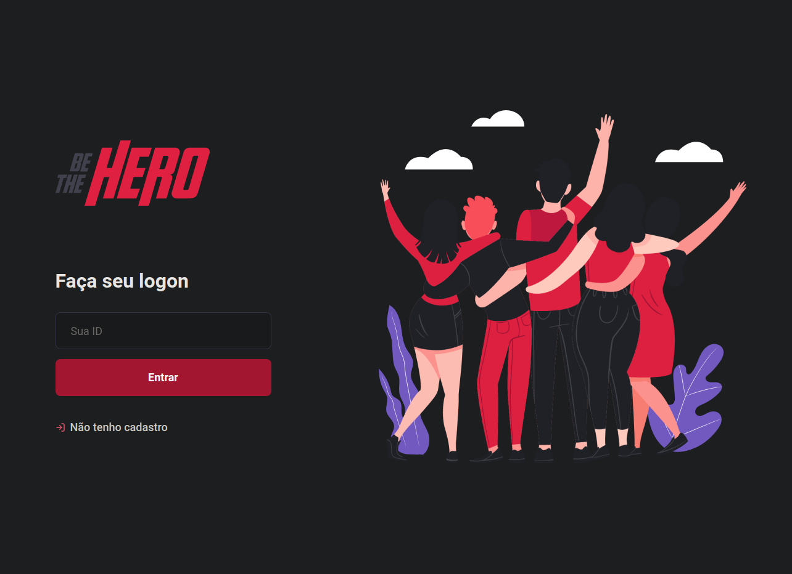
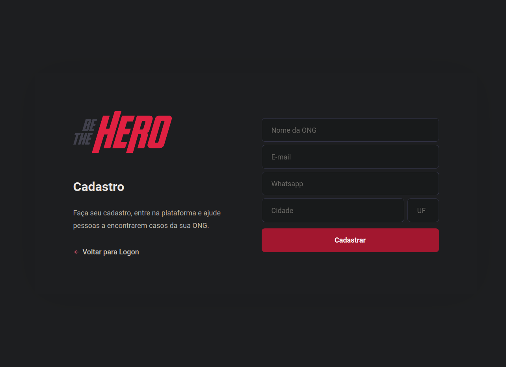
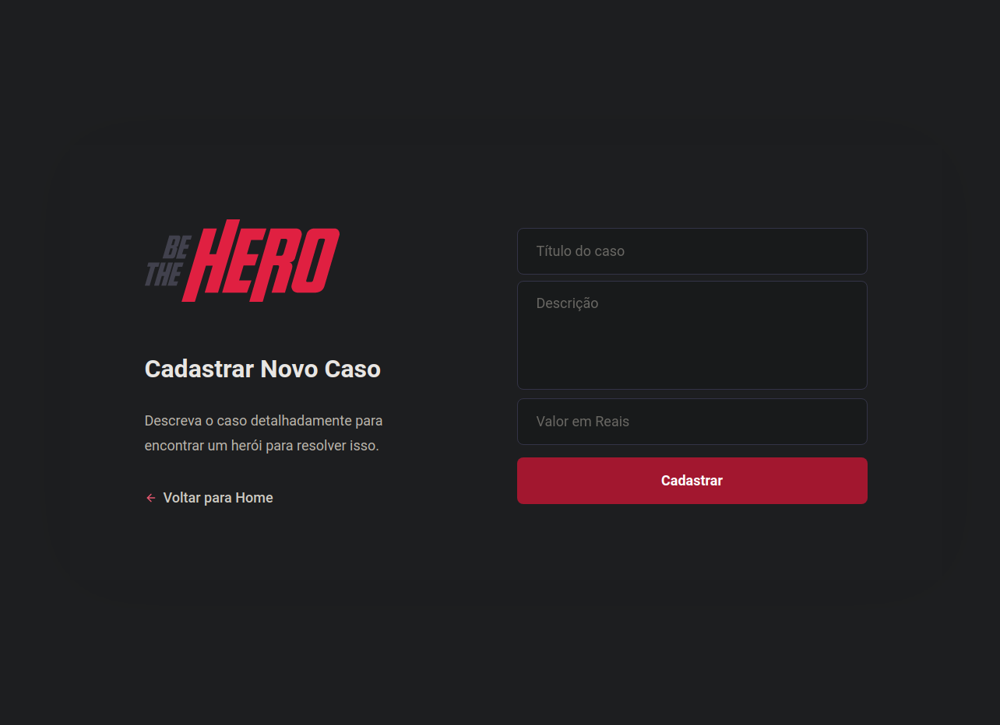
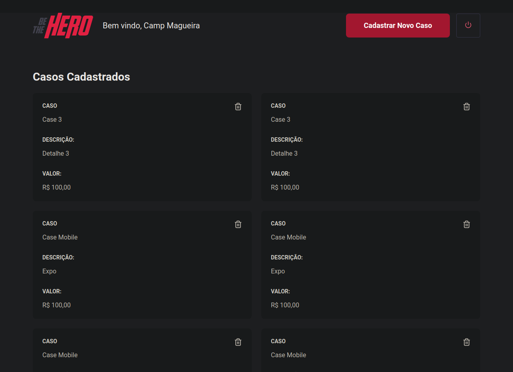

<p align="center">
  
</p>

<p align="center">
  
  
  
  
</p>

# Semana Omnistack 11

Interface Web do **Be The Hero**. Aplicação responsável por permitir as ONG's se cadastrarem informando seus dados, como nome, meios de contatos e localização. Além disso, as instituições também adicionam informações sobre os casos que precisam de ajuda.


## ✋🏻 Be The Hero Backend e Mobile 

* [Be The Hero Backend](https://github.com/vitorsemidio-dev/be-the-hero-backend) 
* [Be The Hero Mobile](https://github.com/vitorsemidio-dev/be-the-hero-mobile) 


## 🚀 Como executar o projeto

0. **Pré-requisito: ter o backend rodando**
1. Clone este repositório através do comando `git clone https://github.com/vitorsemidio-dev/be-the-hero-web`
2. Troque para o diretório do projeto
3. Rode `yarn` ou `npm install` para instalar todas as dependências
4. Rode `yarn start` ou `npm start` para iniciar a aplicação

## Imagens do projeto

<p align="center">
  
  
  
  
</p>


## 🎓 Aprendizado

```
  ├── sqlite
  ├── jest
  ├── celebrate
  └── knex
```
